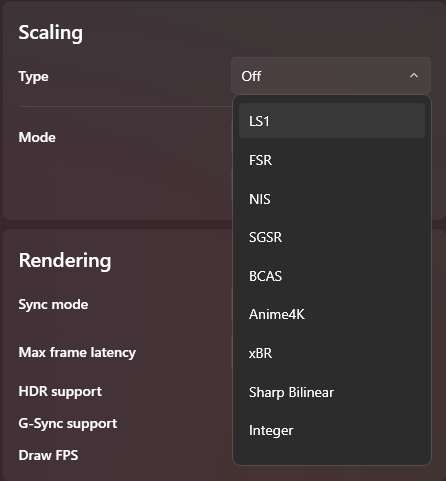
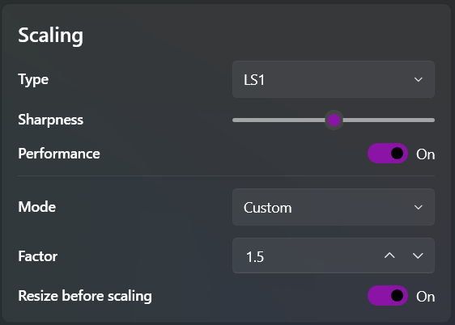

## How to use Scalers in LS?												
The scalers present in LS require Borderless Fullscreen and Windowed Mode to work. To upscale games in Borderless Fullscreen, the Scaling Mode needs to be set to Custom with Resize before scaling enabled. This requires the use of a manual scaling factor where at 4k for example: a factor of 1.2/1.5/2.0 would result in an upscale of 1800p/1440p/1080p to 4k respectively. The Status Tab at the very bottom also displays the resized -> output resolution

Some games may not work with resize before scaling as the game may not like window manipulation when borderless. This is rare, but can be overcome by setting the game to Windowed mode and scaling based off the said window. The Scaling mode needs to be changed to Auto where LS will automatically fill the screen with the correct scaling factor to upscale to native resolution

Scaling without FG/LSFG is currently known to cause unstable frame capture or dropped frames with both WGC/DXGI. A temporary workaround is to either disable Variable Refresh Rate or use FG when using the spatial scalers. This is due to a bug with WDDM from Microsoft which is currently under investigation."																																											
## What is the General Usage and Priority for Scalers?												
LS1 > SGSR/BCAS > FSR > NIS > xBR

The general order above represents how good each of the  scalers are likely to look in any given 3D/2D game. The final image quality of the scaler vary depending on the game and content. All the upscalers in LS work best with ingame Anti-Aliasing (TAA, FXAA, MSAA) enabled. These upscalers are not Anti-Aliasing replacements like SMAA/CMAA2/FXAA
 
The scalers within LS can also be used at native resolution alongside in-game TAA upscalers that do the actual upscaling i.e: DLSS/FSR2/XeSS. This can help with soft/poor in-game TAA implementations, where the LS scaler can improve edge resolve

The compute cost for each upscaler can vary between gpu vendors, therefore there is no universal “lightest spatial scaler”. In general SGSR & BicubicCAS should be the lightest in most systems. FSR1.1 and LS1, with their performance toggles are similar in cost, with LS1 being slightly heavier. The non-performance LS1 upscaler is the heaviest and should be used only when performance is not the primary concern, as it generally looks very similar to LS1 with its Performance toggle enabled.											
												
## Use case & tendency of Scalers?												
### LS1
Use case: Lossless Scaling's own machine learning based upscaler, recommended for use in games/videos with good motion handling. Sharpness values of 0 and 1 preferred to minimise aliasing. The performance toggle significantly reduces its compute cost whilst maintaining similar quality

Tendency: Can effectively reduce both occlusion artifacts and motion smearing. Sharpness values of 2-4 can lead to haloing and dithering in motion. Generally performs the best and is well-suited for games with complex 3D scenes, foliage, particles, and reflections

### SGSR1
Use case: A spatial upscaler by Qualcomm that is light and provides good image quality. Often a superior alternative to Bicubic CAS with a sharper output at a low compute cost. Looks good with 2d pixel art and 3d games and avoids ringing artifacts

Tendency: Uses a 12-tap Lanczos-like scaling filter and adaptive sharpening. Has minimal dithering and avoids oversharpening most scenes. Can struggle with colour banding and blending gradients such as sky/shadows when upscaling from very low internal resolutions

### BCAS
Use case: Combines Bicubic upscaling with Contrast adaptive sharpening, with a similar final look to SGSR. Well suited for pixel art and softer art styles, with very low performance overhead. Can look good with both 2d and 3d content

Tendency: Can have difficulty with texture blending & gradient handling. Games with emphasis on particles, alpha effects and reflections may look soft and less-defined in motion. SGSR may be preferred over BCAS in these circumstances

### FSR
Use case: AMDs spatial upscaler, with both a regular and optimised kernel in Lossless Scaling. FSR1.1 works well with most content and has low compute overhead. Sharpness values of 3-5 look best and will generally not oversharpen games

Tendency: Can mush and blend high frequency detail leading to loss of clarity in high contrast areas. FSR can often look more pixelated and smeary in fast motion; generally around bright foliage. Can avoid dithering in most scenes but has swirling artifacts with alpha effects & shadows from low resolutions

### NIS
Use case: Spatial upscaler from Nvidia that is generally not preferred for either 3d/2d content due to its aggressive use of sharpening. Can be used if one prefers a sharper look or used on a very blurry game  

Tendency: Has general issue with edge contrast, leading to haloing around objects with a dithered look in motion. Very often causes ringing artifacts and over sharpens both textures and geometry. Generally not preferred and should be avoided

### xBR
Use case: xBR is a semi-popular pixel art/retro game upscaler. It performs diagonal smoothing very aggressively to remove jagged lines. Typically used to upscale 3rd to 5th generation of console games

Tendency: A mostly artistic shader with an oil painting resolve. Makes pixel art content blurry with aggressive smoothing that lead to loss of detail. Generally ruins the intended look of older games and looks unnatural  

### Anime4k
Use Case: Strictly intended to be used on 1080p sources, which it upscales to 4k. Does not work well and has issues with low bitrate/resolution video sources such as 720p

Tendency: Can be very computationally heavy when using the Very Large/Ultra Large models. LS uses the stock Anime4K shader and does no additional sharpness pass unlike the Magpie version. LS1 can often look similar/better at a cheaper compute cost"											

## How to use Custom Scale?

All spatial scalers improve as the base resolution increases. Therefore higher resolution displays can leverage larger scaling factors and maintain good image quality (i.e: A factor of x1.5 can look good at 4k but not as presentable at 1080p). The scaling factors below are a rough guide, which can be lowered or increased based on personal tolerance/need

- x1.20             at 1080p (900p internal res)
- x1.33             at 1440p (1080p internal res)
- x1.20 - 1.50      at 2160p (1800p to 1440p internal res)
