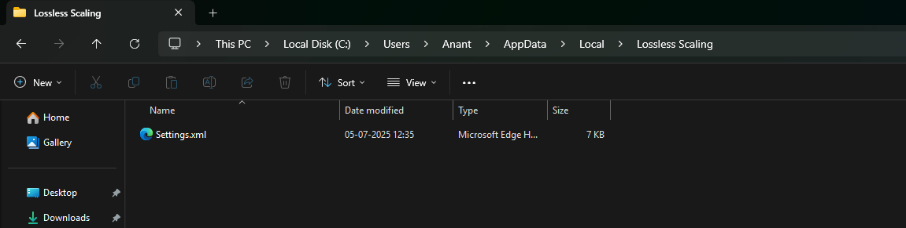

- The settings and profiles of LS are saved in the settings.xml file located in C:\Users\'Username'\Appdata\Local\Lossless Scaling\Settings.xml

- Deleting this can also fix some crashing issues with LS app.

> *by- Sage*