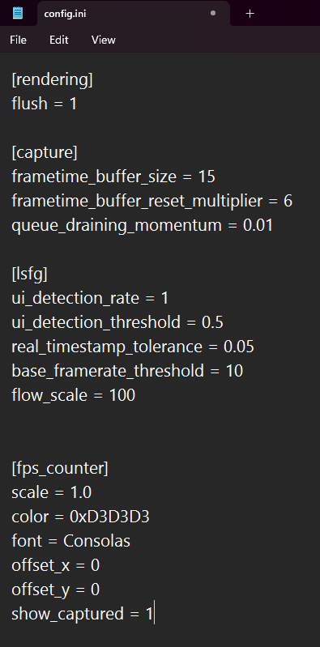

	
>> **IT IS NOT RECOMMENDED TO CHANGE THESE VALUES UNLESS YOU HAVE SPECIFIC REASONS (make a backup)**

| Parameters | Info/Impact |
| :---: | :--- |				
| ***[rendering]*** |
| flush = 1	| In some cases, changing this to 0 with DXGI can solve stability issues. For WGC, flush helps in stability with VRR significantly |
| ***[capture]*** |
| frametime_buffer_size = 15 | *These are the buffers used for capture,* |
| frametime_buffer_reset_multiplier = 6	| *It is best not to mess with these...* |
| queue_draining_momentum = 0.01 | *theoretically these can influence latency, but increases instability* |
| ***[lsfg]*** |   |
| ui_detection_rate = 1 | The iterations for UI detection mask |
| ui_detection_threshold = 0.5 |	This is the value clamp of the ui mask, at 1.0, it removes everything/ui detection off. So its the range of 0-1 |
| real_timestamp_tolerance = 0.05 |	The time window between which, Real frames are presented instead of Generated ones- for AFG only |
| base_framerate_threshold = 10 | This is the minimum base fps below which FG stops working |
| flow_scale = 100 | Manually change the flowscale beyond the slider in UI |		
| ***[fps_counter]***	| For formatting the LS fps counter which is enabled on "Draw FPS option", visible at the top left of the screen |
| scale = 1.0 | Size of the counter  |
| color = 0xD3D3D3 | Colour of the counter (hex code) |			
| font = Consolas | Font family of the counter  |			
| offset_x = 0	| Distance from left side of the screen   |		
| offset_y = 0	| Distance from top of the screen  |		
| show_captured = 1 |   |

> *by- Sage*