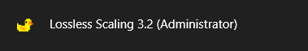
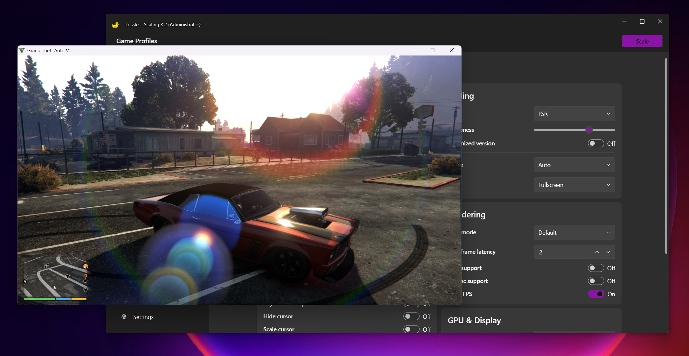
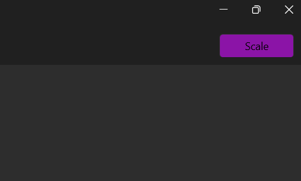
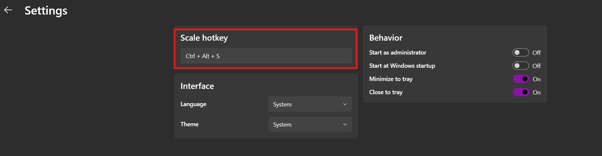
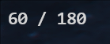
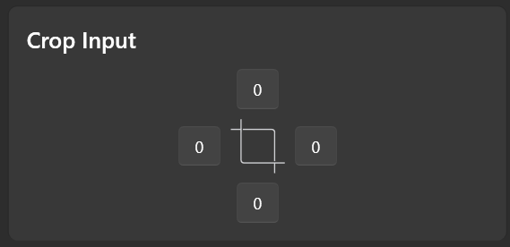

1.  Run Lossless Scaling ('LS') preferably as admin via the in-app setting and restart, or right-click on the shortcut/exe and select 'Run as Admin'.

    

2.  Run the target app/game in windowed or borderless mode (NOT exclusive fullscreen).

    

3.  Click the 'Scale' button and select the game window within 5 seconds, OR select the game and press the 'Scale' hotkey.

    
    

4.  The FPS counter in the top-left shows the "base FPS"/"final FG FPS" and confirms that LS has successfully scaled. (The 'Draw FPS' option must be enabled for this.)

    

5.  For videos in local players such as KMPLayer, VLC, or MPV, the process is the same. (If you want to upscale, resize the video player to its original size and then use the LS scalers.)

    

6.  For video streaming in browsers, there are three ways:
    *   Download a PiP (Picture-in-Picture) extension in your browser (better for hard-subbed videos), play the video in a separate, resized window, and then scale it with LS.
    *   Fullscreen the video and scale with LS.
    *   Use the 'Crop Pixels' option in LS. You will need to measure the pixel distance from the edges of the screen and input it into the LS app. (You can use PowerToys' Screen Ruler for the pixel measurements.)
