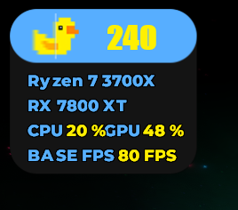
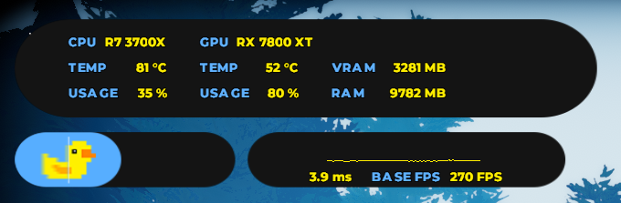
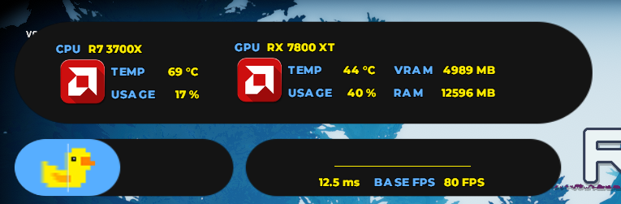
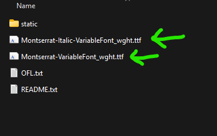

---
## Guide 1 

### Step 1: Install Rivatuner Statistics Server  
**Download Link:** [RTSS](https://www.guru3d.com/download/rtss-rivatuner-statistics-server-download/)  

### Step 2: Download the Overlay theme you want  


1. [LS Compact Dark](https://drive.google.com/uc?export=download&id=1dmYuLv2T33FQP3esDZ0y5Q9WWC-AMIrc)



2. [LS Standard Dark](https://drive.google.com/uc?export=download&id=1SeguO8kg8-t3vGbt5QmGnwSRpn15EFaA)



3. [AMD Logo Standard Dark](https://drive.google.com/uc?export=download&id=1q8KgOhROCTNkk5xt7YXU2-IJoPAeGhWx)



### Step 3: Download and install this font file  
- **Font:** [Montserrat](https://drive.google.com/uc?export=download&id=1d9thitVnrovmlXxHP4GhF5HFUsHK3NnH)  


### Step 4: Follow the steps in the video  
- **Video Guide:** [Video Guide by ZifuGG](https://drive.google.com/uc?export=download&id=1gjt62N4b_rj-UmdqHNCUD7RuRkBisenb)  

### Directory for Rivatuner .ovx file  

'C:\Program Files (x86)\RivaTuner Statistics Server\Plugins\Client\Overlays'

Lossless Scaling FPS Counter Configuration

[fps_counter]
- scale = 2.0
- color = 0xfff000
- font = Impact
- offset_x = 150
- offset_y = 145
- show_captured = 0

---

## Guide 2 

**Important Note:**  
WORKS WITH DXGI CAPTURE API ONLY AND DOES NOT REQUIRE LS OVERLAY TO WORK  

### Prerequisites:
1. Install **[Montserrat](https://drive.google.com/uc?export=download&id=1d9thitVnrovmlXxHP4GhF5HFUsHK3NnH)** font
2. In RTSS interface:
   - Set **On Screen Display Rendering Mode** to **Raster 3D**
   - Change font to:
     - Font: Montserrat
     - Weight: Extra Bold
     - Size: 7
   - *Note:* Apply to all profiles separately if needed

### Installation Steps:

#### Step 1: Install AutoHotkey
- Download from: [AutoHotkey](https://www.autohotkey.com/)
- Install the latest version (required to open AHK scripts)

#### Step 2: Copy Overlay Files
1. Download files (OVL and PNG from Guide 1)
2. Copy to:
  
   C:\Program Files (x86)\RivaTuner Statistics Server\Plugins\Client\Overlays
 
   - Overwrite if `presentmon_custom.ovl` exists

#### Step 3: Configure Overlay
1. Enable and open overlay editor
2. Click:
   - Layouts → Load
   - Select your `presentmon_custom.ovl`
   - Layouts → Save

#### Step 4: Find Process ID
1. Open Task Manager → Details tab
2. Find PID number for Lossless Scaling.exe
   - *Remember this number*

#### Step 5: Set Process ID in Overlay
1. Open overlay editor
2. Layouts → Edit
3. Environmental Variables:

   PM_ProcessId=3302  (replace 3302 with your actual PID)
 
4. Layouts → Save

#### Step 6: AHK Script Setup
- Download `Attach-Lossless Scaling.ahk`
- **Purpose:** Automatically switches PID number
- **Important Notes:**
  - Required to capture LSFG FPS
  - Must set correct PID once before script works
  - Script will auto-switch PID after initial setup
  - PID changes when:
    - Closing Lossless Scaling
    - Restarting PC
  - Usage:
    - Double-click AHK file to update PID
    - Keep Lossless Scaling in tray
    - Use hotkeys when possible
- **Credit:** Script by @Evil Quaint

### Additional Resources:
- [Video Guide](https://drive.google.com/file/d/19CnJGglohYQNVwl1HB1nlm06HokIzs8D/view?usp=sharing)
- [AHK File](https://drive.google.com/uc?export=download&id=184lQ5oKMc1yMQyJIRial2ML8tccJ5yIh)
---


## Guide 3

### Required Downloads:
- [HWinfo](https://www.hwinfo.com/download/)
- [MSI Afterburner](https://www.msi.com/Landing/afterburner/graphics-cards)

### Configuration Steps:

#### Step 1: HWinfo Settings
1. Open HWinfo
2. Go to:
   - Settings → Customize

#### Step 2: Rename Frame Rate Metric
1. Locate the PresentMon section
2. Find "Framerate (Presented)"
3. Rename it to "LSFG" (or your preferred name)
   - **Important:** Rename the bottom one, not the top one
4. Click "Rename" to apply

#### Step 3: Enable OSD Display
1. Stay in HWinfo Settings
2. Navigate to:
   - OSD (RTSS) section
3. Find your renamed metric (LSFG)
4. Enable:
   - Show value in OSD
   - Show label in OSD
5. Click OK

#### Step 4: MSI Afterburner Setup
1. Open MSI Afterburner
2. Go to:
   - Settings → Monitoring
3. Next to "Monitoring sensors":
   - Click the three dots (...)
   - Select "Activate HwInfo.dll"
4. Click OK

### Completion:
**Ready.** Your frame generation metrics should now appear in your OSD.


## Guide 4

### Required Downloads:
- [OVL file](https://drive.google.com/uc?export=download&id=1w6W1InivrOWA8Vfh-JT9UpCUSBOjwwJk)
- [RTSS](https://www.guru3d.com/download/rtss-rivatuner-statistics-server-download/) 
- [PNG file](https://drive.google.com/uc?export=download&id=1TyTyBShe884UKjdb7PgZgQprbG7OZicb)

### Installation Steps:

#### Step 1: Place Overlay Files
Copy these files to:
```plaintext
C:\Program Files (x86)\RivaTuner Statistics Server\Plugins\Client\Overlays
```
- `losslessdualgpu.ovl`
- `Custom Overlay.png`

#### Step 2: Configure FPS Counter
Add this to your config.ini:

[fps_counter]
scale = 1
color = 0xfbf673
font = Unispace
offset_x = 242
offset_y = 46
show_captured = 0

Location:

C:\Program Files (x86)\Steam\steamapps\common\Lossless Scaling\config.ini


**Note:** These offset values work for 1080p - adjust `offset_x` and `offset_y` for 1440p displays.

### Overlay Setup:
1. Setup → Plugins → `OverlayEditor.dll`
2. Layout → Edit → Browse under 'Embedded Image'
3. Select `Custom Overlay.png`
4. Data Sources → Add → MSI Afterburner
5. Check all relevant sources
6. Load `losslessdualgpu.ovl`
7. Press `Ctrl + Shift + L`
8. Customize names, sizes, and colors as needed

