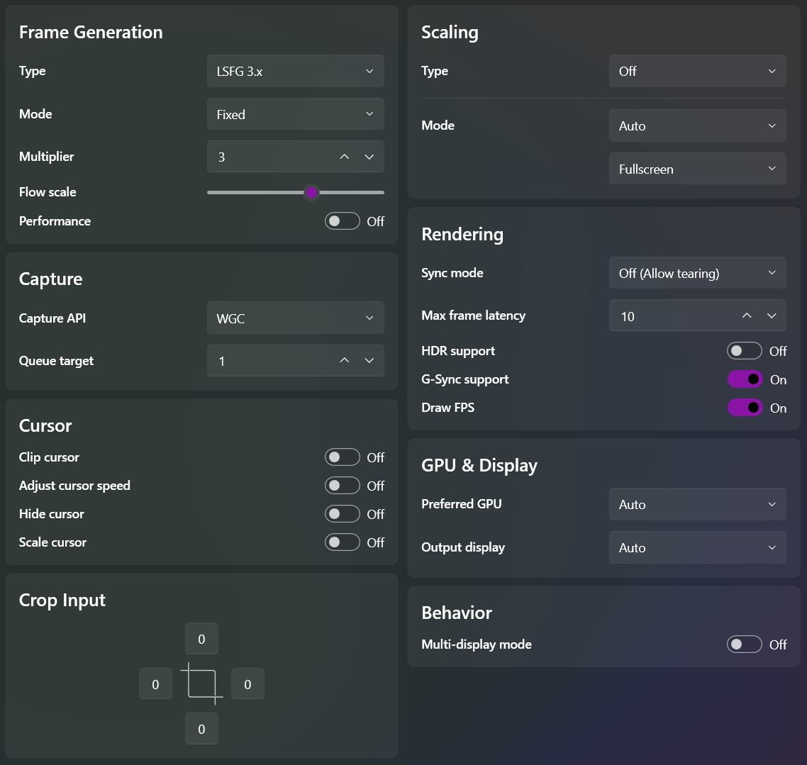
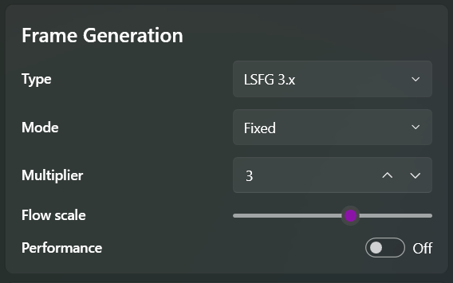
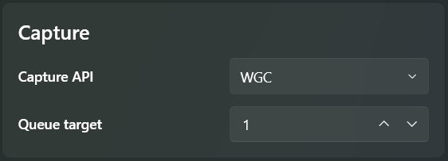
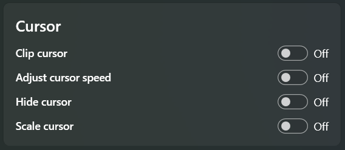
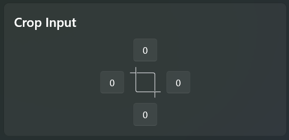
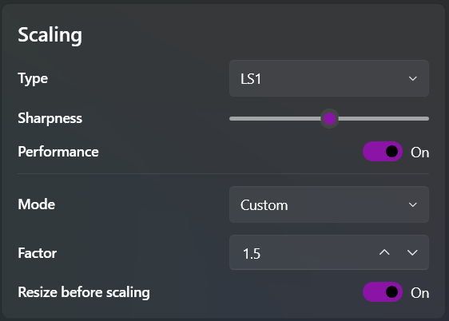
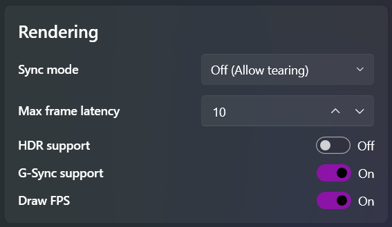
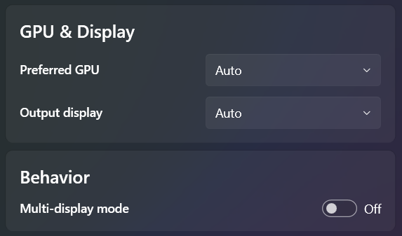

## 1.1 Frame Generation

### Type
- LSFG version (newer is better)

###	Mode

- Fixed Integer : Less GPU usage
- Fractional : More GPU usage
- Adaptive 	(Reaches target FPS) : Most GPU usage and Smoothest framepacing

###	Flow scale 
- Higher value = Better quality generated frames (generally, but not always), significantly more GPU usage, and fewer artifacts.
- Lower value  = Worse quality generated frames (generally, but not always), significantly less GPU usage, and more artifacts.

###	Performance
- Lower GPU usage and slightly lower quality generated frames.

## 1.2 Capture									

###	Capture API
- DXGI : Older, slightly faster in certain cases, and useful for getting Hardware-Independent Flip
- WGC : Newer, optimized version with slightly more usage (only available on Windows 11 24H2). Recommended API for most cases; offers better overlay and MPO handling.

###	Queue Target
- 0 : Unbuffered. Lowest latency, but a high chance of unstable output or stutters
- 1 : Ideal value. 1-frame buffer; a balance of latency and stability.
- 2 : 2-frame buffer for special cases of very unstable capture.

## 1.3 Cursor

###	Clip Cursor
- Traps the cursor in the LS output

###	Adjust Cursor Speed
- Decreases mouse sensitivity based on the target game's window size.

###	Hide Cursor
- Hides your cursor

### Scale Cursor
- Changes the cursor's size when enabled with upscaling.

## 1.4 Crop Input 

- Crops the input based on pixels measured from the edges (useful when you want to ignore a certain part of the game/program being scaled).

## 1.5 Scaling

###	Type
- Off : No Scaling
- Various spatial scalers. Refer to the 'Scalers' section in the FAQ.

###	Sharpness
- Available for some scalers to adjust image sharpness.

###	Optimized/Performance
- Reduces quality for better performance (for very weak GPUs).

###	Mode
- Custom : Allows for manual adjustment of the scaling ratio.
- Auto : No need to calculate the ratio; automatically stretches the window.

###	Factor
- Numerical scaling ratio (Custom Scaling Mode Only)
- Fullscreen :  Stretches the image to fit the monitor's size (Auto Scaling Mode only).
- Aspect Ratio : Maintains the original aspect ratio, adding black bars to the remaining area (Auto Scaling Mode only).

###	Resize before Scaling 
- Only for Custom Scaling Mode: Resizes the game window based on the Factor before scaling to fit the screen.

## 1.6 Rendering							

###	Sync Mode
- Off(Allow tearing) : Lowest latency, can cause tearing.						
- Default : Balanced. No tearing and slight latency (not V-Sync).					
- Vsync	 (Full, Half, 1/3rd): More latency, better tear handling. Will limit the final FPS to a fraction of the monitor's refresh rate, which can break FG frame pacing.
			
###	Max Frame Latency 
- 2, 3, 10 are the recommended values.			
- The lowest latency is at 10, but this causes higher VRAM usage and may crash in some scenarios. The latency range is ~0.5ms in non-bottlenecked situations.
- Higher MFL value doesn't mean lower latency. It is only true for the value 10, and would slightly increase when you either reduce it or increase it. The default of 3 is generally good enough for most cases. 
- MFL 10 is more relevant in dual GPU setups

###	HDR Support 
- Enables support for HDR content; uses more VRAM.

###	Gsync Support 
- Enables support for G-Sync compatible monitors.

###	Draw FPS 
- Lossless Scaling's built-in FPS counter. Displayed in the top-left by default and can be formatted via the config.ini file.

## 1.7 GPU & Display

###	Preferred GPU 
- Selects the GPU to be used by the Lossless Scaling app (this does not affect the game's rendering GPU).

###	Output Display 
- Specifies the LS output display in a multi-monitor setup. Defaults to the primary display.

## 1.8 Behaviour

### Multi Display Mode 
- For easier multitasking in case of multiple displays. Enabling this will keep the LS output active even when the cursor or focus is shifted to another display. By default, LS unscales when it loses focus.

> *by- Sage*