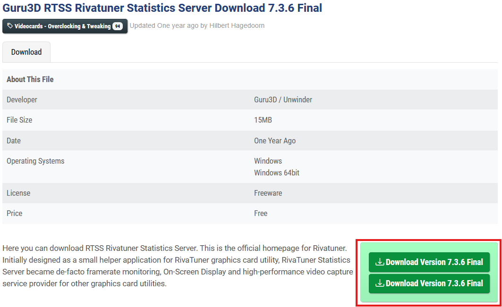
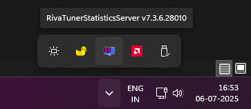
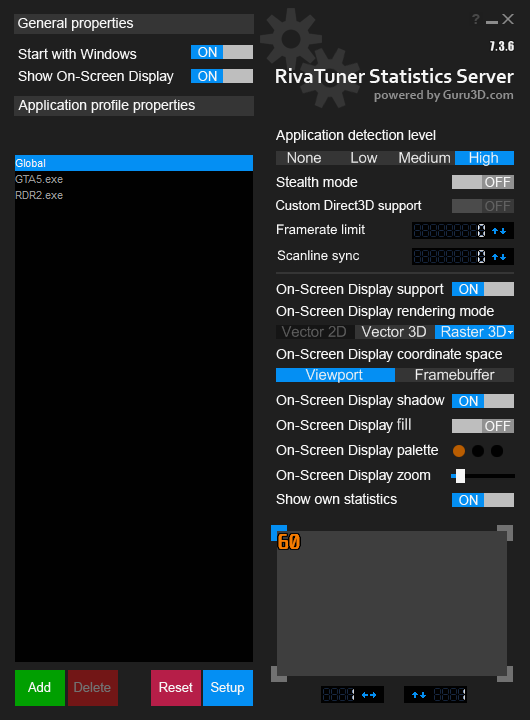
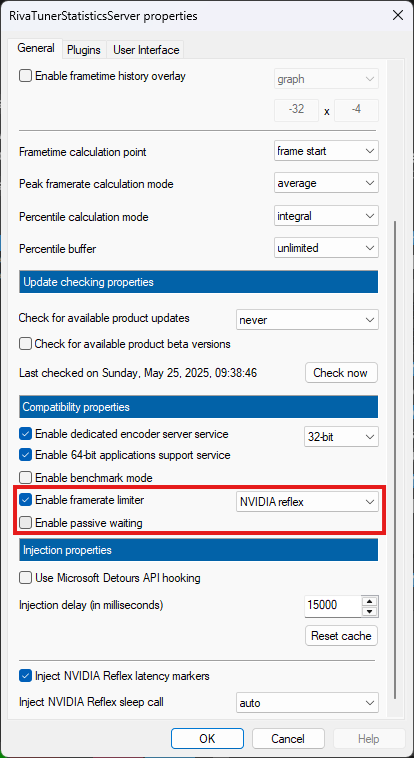
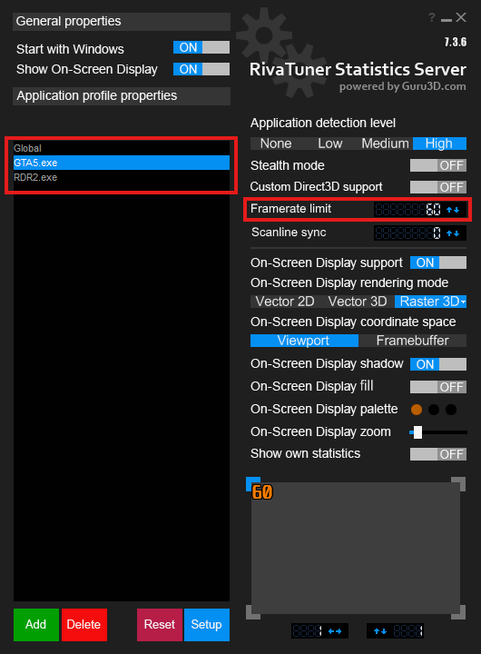

1.  Download [RTSS from here](https://www.guru3d.com/download/rtss-rivatuner-statistics-server-download/) (if not downloaded already).

2.  Install and run RTSS.

3.  Toggle on 'Start with Windows'.

4.  Click the blue 'Setup' button, scroll down, enable 'Framelimiter to NVIDIA Reflex', disable passive waiting and then click 'OK'.

5.  Select the game's executable (.exe) by clicking the green 'Add' button and browsing to its file location.

6.  The game will be added to the list on the left (as shown here with GTAV and RDR2).

7.  Select the game from the list to cap its base FPS, enter the desired value, press Enter, and you are done.

> *by- Sage*