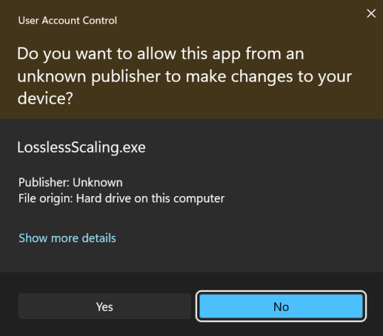
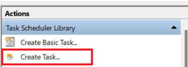
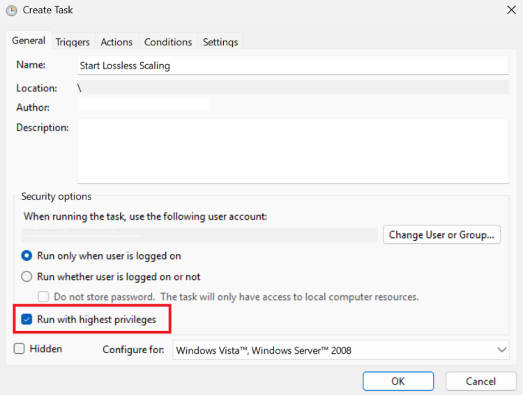
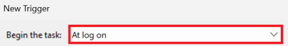
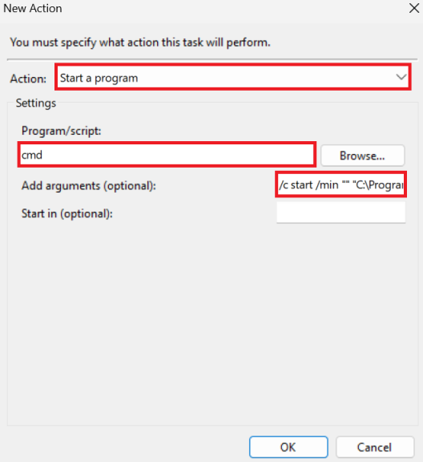
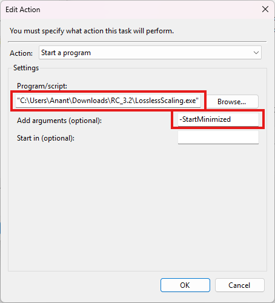
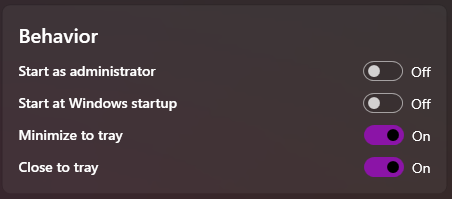
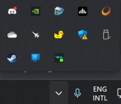

If you are using both **Start as Administrator** and **Start minimized at Windows startup** at the same time, you will likely get an annoying prompt every time you start and log into your PC. You can avoid this by creating a Task Scheduler task that automatically starts Lossless Scaling minimized and with administrator privileges when you log in.

Here's how to do it:

Open Task Scheduler and select **Create Task...**.

In the **General** tab, enable **Run with highest privileges**. If you are using a non-admin account, also select **Run whether user is logged on or not**.

In the **Triggers** tab, create a new trigger and set 'Begin the task' to **At log on**. Then click **OK**.

In the **Actions** tab, create a new **Start a program** action. In the 'Program/script' box, type `cmd` and in the 'Add arguments' box, type the following (copy it precisely):
`/c start /min "" "[LosslessScaling.exe path]" ^&exit`

If this doesn't work, you can also click **Browse...** next to 'Program/script' and navigate directly to `LosslessScaling.exe`, or just paste the full path to the executable. Then, in the arguments box, type `-StartMinimized`. This method has been proven to work in scenarios where the other one did not, so feel free to try both.

If you cannot find the executable, go to Lossless Scaling in your Steam library, click the gear icon, select **Manage**, and then **Browse local files**. You can find and copy the path of `LosslessScaling.exe` there. It is likely located in a path similar to `C:\Program Files (x86)\Steam\steamapps\common\Lossless Scaling`.

After this, click **OK**, change any other settings as desired, and click **OK** again to create the task.

Finally, disable **Start minimized at Windows startup** in the Lossless Scaling settings. You can also enable **Minimize to tray** so that the application does not appear on the taskbar.

Restart your PC, and you should find Lossless Scaling minimized after you log on, without an annoying User Account Control prompt.

> *Credits - Ravenger & Sage*