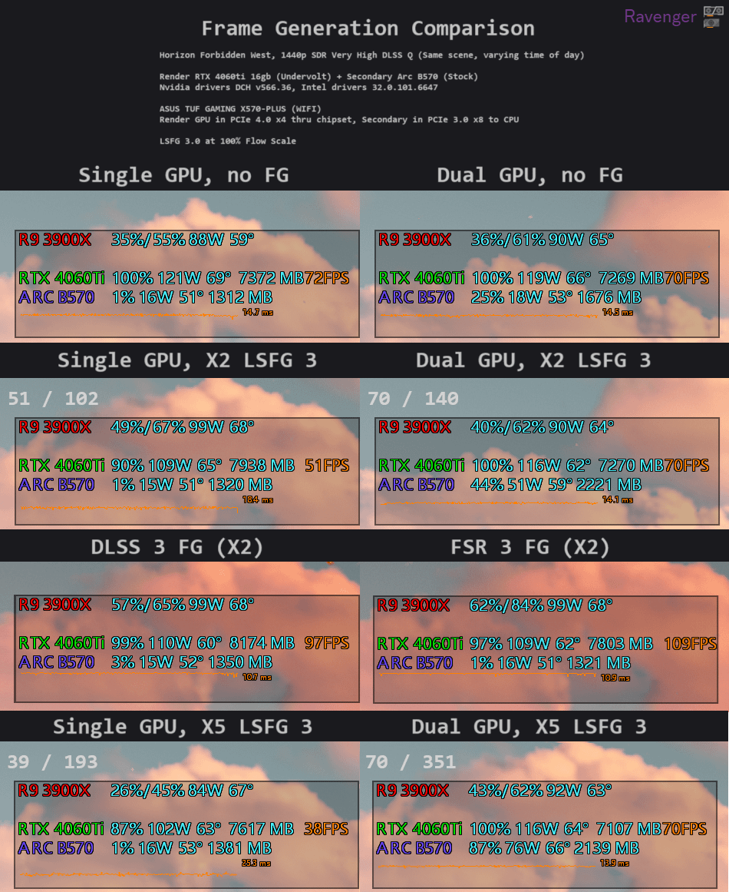
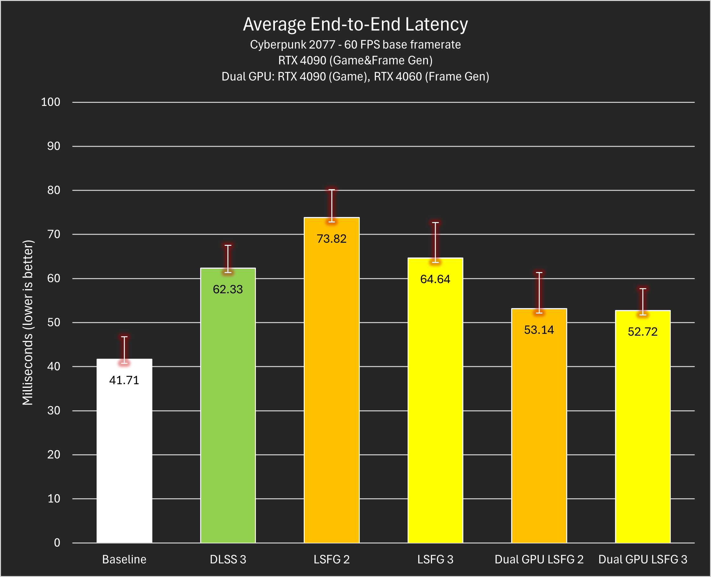
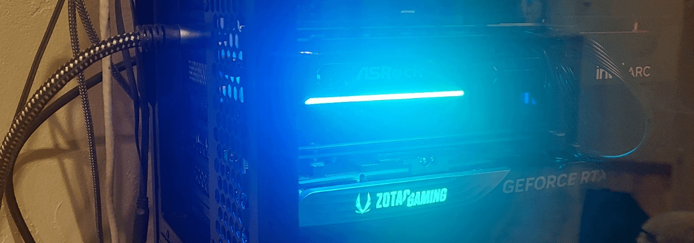
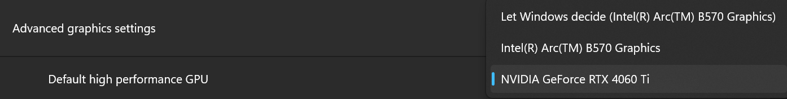
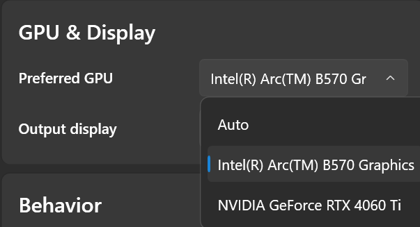

> This is based on extensive testing and data from many different systems. The original guide as well as a dedicated dual GPU testing chat is on the Lossless Scaling Discord Server.

## What is a Dual GPU setup for Lossless Scaling?

- Frame Generation uses the GPU, and often a lot of it. When frame generation is running on the same GPU as the game, they need to share resources, reducing the amount of real frames that can be rendered. This applies to all frame generation tech. However, a secondary GPU can be used to run frame generation that's separate from the game, eliminating this problem. This was first done with AMD's AFMF, then with LSFG soon after its release, and started gaining popularity in Q2 2024 around the release of LSFG 2.1.

- When set up properly, a dual GPU LSFG setup can result in nearly the best performance and lowest latency physically possible with frame generation, often beating DLSS and FSR frame generation implementations in those categories. Multiple GPU brands can be mixed.

Image credit: Ravenger. Display was connected to the GPU running frame generation in each test (4060ti for DLSS/FSR).

Chart and data by u/CptTombstone, collected with an OSLTT. Both versions of LSFG are using X4 frame generation. Reflex and G-sync are on for all tests, and the base 
framerate is capped to 60fps. Uncapped base FPS scenarios show even more drastic differences.

## How the Dual GPU setup works:
- Real frames (assuming no in-game FG is used) are rendered by the render GPU.
- Real frames copy through the PCIe slots to the secondary GPU. This adds ~3-5ms of latency, which is far outweighed by the benefits. PCIe bandwidth limits the framerate that can be transferred. More info in System Requirements.
- Real frames are processed by Lossless Scaling, and the secondary GPU renders generated frames.
- The final video is outputted to the display from the secondary GPU. If the display is connected to the render GPU, the final video (including generated frames) has to copy back to it, heavily loading PCIe bandwidth and GPU memory controllers. Hence, step 2 in Guide.

## System requirements 
> (points 1-4 apply to desktops only):
1. Windows 11; Windows 10 requires registry editing to get games to run on the render GPU : [Win10-Registry for selecting High Perf GPU ](https://www.reddit.com/r/AMDHelp/comments/18fr7j3/configuring_power_saving_and_high_performance/) and may have unexpected behavior.
2. A motherboard that supports good enough PCIe bandwidth for two GPUs. The limitation is the slowest slot of the two that GPUs are connected to. Find expansion slot information in your motherboard's user manual. Here's what we know different PCIe specs can handle:
3. PCIe requirements: 
- Anything below PCIe 3.0 x4: GPU may not work properly, not recommended for any use case.
- PCIe 3.0 x4 or similar: Good for 1080p 360fps, 1440p 230fps and 4k 60fps (4k not recommended)
- PCIe 4.0 x4 or similar: Good for 1080p 540fps, 1440p 320fps and 4k 165fps
- PCIe 4.0 x8 or similar: Good for 1080p (a lot)fps, 1440p 480fps and 4k 240fps
> These values are accounted for HDR, overheads and having enough bandwidth for the secondary GPU to perform well. Reaching higher framerates is possible, but these guarantee a good experience.
4. This is very important. Be completely sure that both slots support enough lanes, even if they are physically x16 slots. A spare x4 NVMe slot and adapter can be used, though it is often difficult and expensive to get working. Note that Intel Arc cards may not function properly for this if given less than 8 physical PCIe lanes (Multiple Arc GPUs tested have worked in 3.0 x8 but not in 4.0 x4, although they have the same bandwidth).
5. If you're researching motherboards:
- [Tommy's List](https://docs.google.com/document/d/e/2PACX-1vQx7SM9-SU_YdCxXNgVGcNFLLHL5mrWzliRvq4Gi4wytsbh2HCsc9AaCEFrx8Lao5-ttHoDYKM8A7UE/pub)
-  For more detailed information on AMD motherboards, I recommend u/3_Three_3's motherboard spreadsheets:
- [AM4-Motherboards](https://docs.google.com/spreadsheets/d/1NQHkDEcgDPm34Mns3C93K6SJoBnua-x9O-y_6hv8sPs/edit?gid=2064683589#gid=2064683589) 
- [AM5-Motherboards](https://docs.google.com/-spreadsheets/d/1-cw7A2MDHPvA-oB3OKXivdUo9BbTcsss1Rzy3J4hRyA/edit?gid=2112472504#gid=2112472504)
6. Both GPUs need to fit.
7. The power supply unit needs to be sufficient.
8. A good enough 2nd GPU. If it can't keep up and generate enough frames, it will bottleneck your system to the framerate it can keep up to.
9. Higher resolutions and more demanding LS settings require a more powerful 2nd GPU.
10. The maximum final generated framerate various GPUs can reach at different resolutions with X2 LSFG is documented here: Secondary GPU Max LSFG Capability Chart. Higher multipliers enable higher capabilities due to taking less compute per frame.
11. Unless other demanding tasks are being run on the secondary GPU, it is unlikely that over 4GB of VRAM is necessary unless above 4k resolution.
12. On laptops, iGPU performance can vary drastically per laptop vendor due to TDP, RAM configuration, and other factors. Relatively powerful iGPUs like the Radeon 780m are recommended for resolutions above 1080p with high refresh rates.

## The Guide:
1. Install drivers for both GPUs. If each are of the same brand, they use the same drivers. If each are of different brands, you'll need to seperately install drivers for both.
2. Connect your display to your secondary GPU, not your rendering GPU. Otherwise, a large performance hit will occur. On a desktop, this means connecting the display to the motherboard if using the iGPU. This is explained in How it works/4.

Bottom GPU is render 4060ti 16GB, top GPU is secondary Arc B570.
Bottom GPU is render 4060ti 16GB, top GPU is secondary Arc B570.
3. Ensure your rendering GPU is set in System -> Display -> Graphics -> Default graphics settings.

This setting is on Windows 11 only. On Windows 10, a registry edit needs to be done, as mentioned in System Requirements. 
This setting is on Windows 11 only. On Windows 10, a registry edit needs to be done, as mentioned in System Requirements.
4. Set the Preferred GPU in Lossless Scaling settings -> GPU & Display to your secondary GPU.

Lossless Scaling version 3.1.0.2 UI.
Lossless Scaling version 3.1.0.2 UI.
5. Restart PC.

## Notes and Disclaimers:
1. Using an AMD GPU for rendering and Nvidia GPU as a secondary may result in games failing to launch. Similar issues have not occurred with the opposite setup as of 4/20/2025.
2. Overall, most Intel and AMD GPUs are better than their Nvidia counterparts in LSFG capability, often by a wide margin. This is due to them having more fp16 compute and architectures generally more suitable for LSFG. However, there are some important things to consider:
3. When mixing GPU brands, features of the render GPU that rely on display output no longer function due to the need for video to be outputted through the secondary GPU. For example, when using an AMD or Intel secondary GPU and Nvidia render GPU, Nvidia features like RTX HDR and DLDSR don't function and are replaced by counterpart features of the secondary GPU's brand, if it has them.
4. Outputting video from a secondary GPU usually doesn't affect in-game features like DLSS upscaling and frame generation. The only confirmed case of in-game features being affected by outputting video from a secondary GPU is in No Man's Sky, as it may lose HDR support if doing so.
5. Getting the game to run on the desired render GPU is usually simple (Step 3 in Guide), but not always. Games that use the OpenGL graphics API such as Minecraft Java or Geometry Dash aren't affected by the Windows setting, often resulting in them running on the wrong GPU. The only way to change this is with the "OpenGL Rendering GPU" setting in Nvidia Control Panel, which doesn't always work, and can only be changed if both the render and secondary GPU are Nvidia.
6. The only known potential solutions beyond this are changing the rendering API if possible and disabling the secondary GPU in Device Manager when launching the game (which requires swapping the display cable back and forth between GPUs).
7. Additionally, some games/emulators (usually those with the Vulkan graphics API) such as Cemu and game engines require selecting the desired render GPU in their settings.
8. Using multiple large GPUs (~2.5 slot and above) can damage your motherboard if not supported properly. Use a support bracket and/or GPU riser if you're concerned about this. Prioritize smaller secondary GPUs over bigger ones.
9. Copying video between GPUs may impact CPU headroom. With my Ryzen 9 3900x, I see roughly a 5%-15% impact on framerate in all-core CPU bottlenecked and 1%-3% impact in partial-core CPU bottlenecked scenarios from outputting video from my secondary Arc B570. As of 4/7/2025, this hasn't been tested extensively and may vary based on the secondary GPU, CPU, and game.

> **Credits**
- Compiled and Made by Ravenger
- Darjack, NotAce, and MeatSafeMurderer on Discord for pioneering dual GPU usage with LSFG and guiding me(Ravenger).
- IvanVladimir0435, Yugi, Dranas, and many more for extensive testing early on that was vital to the growth of dual GPU LSFG setups.
- CptTombstone for extensive hardware dual GPU latency testing.
- Everyone who took the time to contribute to the Secondary GPU Max LSFG Capability Chart.
- The Lossless Scaling Discord community.
- THS for creating Lossless Scaling.