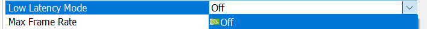
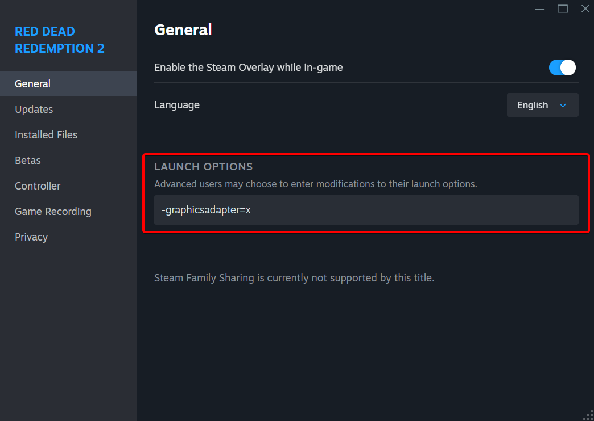
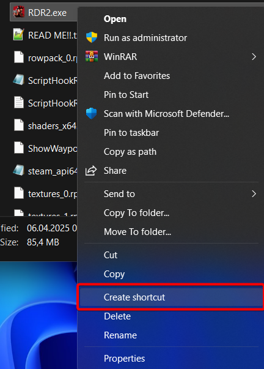
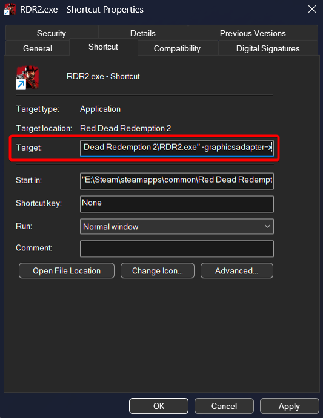
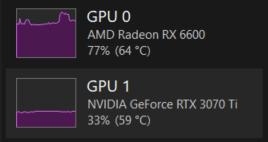

> **If you encounter any issues, the first thing you should do is restart your PC. Consult to the [dual-gpu-testing channel](https://discord.com/channels/1042475930217631784/1344492964298358835) in the Lossless Scaling Discord server or the subReddit for public help if these don't help.**

## Troubleshooting

1. Problem: Framerate is significantly worse when outputting video from the second GPU, even without LSFG.
- Solution: Check that your GPU is in a PCIe slot that can handle your desired resolution and framerate as mentioned in system requirements. A good way to check PCIe specs is with [Techpowerup's GPU-Z](https://www.techpowerup.com/gpuz/). High secondary GPU usage percentage and low wattage without LSFG enabled are a good indicator of a PCIe bandwidth bottleneck. If your PCIe specs appear to be sufficient for your use case, remove and changes to either GPU's power curve, including undervolts and overclocks. Multiple users have experienced this issue, all cases involving an undervolt on an Nvidia GPU being used for either render or secondary. Slight instability has been shown to limit frames transferred between GPUs, though it's not known exactly why this happens.
Beyond this, causes of this issue aren't well known. Try uninstalling all GPU drivers with DDU (Display Driver Uninstaller) in Windows safe mode and reinstall them. If that doesn't work, try another Windows installation.

2. Problem: Framerate is significantly worse when enabling LSFG with a dual GPU setup.
- Solution: First, check if your secondary GPU is reaching high load. One of the best tools for this is [RTSS (RivaTuner Statistics Server) with MSI Afterburner](https://www.msi.com/Landing/afterburner/graphics-cards). Also try lowering LSFG's Flow scale to the minimum and using a fixed X2 multiplier to rule out the secondary GPU being at high load. If it's not at high load and the issue occurs, here's a couple things you can do:
-Reset driver settings such as Nvidia Control Panel, the Nvidia app, AMD Software: Adrenalin Edition, and Intel Graphics Software to factory defaults.

- Disable/enable any low latency mode and Vsync driver and game settings.

- Uninstall all GPU drivers with DDU (Display Driver Uninstaller) in Windows safe mode and reinstall them.
- Try another Windows installation (preferably in a test drive).

3. Problem: The game fails to launch when the display is connected to the secondary GPU and/or runs into an error code such as getadapterinfo (Common in Path of Exile 2 and a few others)
- Solution: Set the game to run on a specific GPU (that being the desired render GPU) in Windows graphics settings. This can only be done on Windows 11 24H2. And if it still is not working then try the forcing methods mentioned ahead....

---  

## Launch-options/arguments method for forcing a GPU as render GPU :
These are the launch argumets that have been proven to help forcing a GPU as render GPU for games :
- `-graphicsadapter=X` *(Unreal Engine/some engines)*  
- `-force-device-index X` *(Unity Engine)*  
- `+r_physicalDeviceIndex X` *(id Tech engines; may require* `+com_skipIntroVideo 1`*)*  

>> **ABOUT X VALUES:**  
- Typically `0`, `1`, or `2` *(GPU number)*  
- Try all values if unsure  
- This numbering **does not always match** Task Manager’s GPU index  

>> **EXAMPLE COMMANDS:**  
 -graphicsadapter=0  
 -force-device-index 0  
 "+com_skipIntroVideo 1 +r_physicalDeviceIndex 0"  
  

### **Usage Instructions:**  

#### **STEAM GAMES:**  
1. Right-click the game → **Properties**  
2. Enter the argument in the **"Launch Options"** field  

#### **NON-STEAM GAMES:**  

- **OPTION A (Via Steam):**  
  1. Add the game to your Steam library  
  2. Set the launch option as described above  

- **OPTION B (Shortcut):**  
  1. Right-click the game shortcut → **Properties**  

  

  2. Append the argument to the **"Target"** field with a space:  
     - Example: `"game.exe" -graphicsadapter=0`  

     
     

  3. Always launch via this shortcut  

**NOTES:**  
- Some stubborn cases (e.g., *Battlefield 2042, Minecraft, Cyberpunk on some systems*) may not work with this method.  
- No reliable 'software workaround' exists for these exceptions. These can be tackled through the phyical workarounds give further ahead.... 

Here’s your corrected and well-organized version with minimal changes for clarity and consistency:  

---  

## Physical methods for forcing a GPU as render GPU :

#### Cable Switch Method:
   - Connect the monitor to the **render GPU**.  
   - Launch the game.  
   - Reconnect to the **secondary GPU for LSFG**.  

#### Dual-Cable Method:  
   - Connect **one monitor to both GPUs**.  OR if you have two monitors, then connect one GPU to each monitor/display.
   - Launch the game when the display is through the port connected to **render GPU**.  
   - **FOR SINGLE MONITOR -** After successful boot of the game, switch the display to the port connected to **secondary GPU**.  
   - **FOR DUAL MONITOR -** After following the first two steps as mentioned above... move the window using win+tab key (TaskView) to the **secondary GPU**.
   - Scale the game with LS.
  
> *This works for majority of games however there are some more stubborn games that don't work, for which the next method can be used.....*
---  

### Headed render GPU problem :  
- **Occurs in some GPU/application combos** (e.g., dual Intel setups, or nvidia as secondary. etc —but no reliable way to predict).  
- **Why It Happens:**  
  - Some applications need an  **active physical display target** to output rendred frames. 
  - GPU drivers **require display properties info** (resolution, refresh rate). Which causes conflicts (When Using a "Headless" Render GPU—No Display Connected) :  
    - Application may **fail to launch** or crash on loading screens.  
    - **Degraded performance** or low FPS.  

> **EXCLUSIVE FULLSCREEN :**
Since Lossless Scaling (LS) **cannot overlay** in true exclusive fullscreen, the following methods can also be used to bypass this limitation.  

#### METHOD 1: Dual-Monitor / Dual-Instance Setup
- **Concept:** Physically separate **rendering** and **output**.  
- **Hardware Setup:**  
  → **Monitor A:** Connected to **Render GPU**.  
  → **Monitor B:** Connected to **Secondary (LSFG) GPU**.  
- **Workflow:**  
  1. Game runs on **Monitor A (Render GPU)**.  
  2. Lossless Scaling captures **Monitor A**.  
  3. LS outputs **frame-generated version** to **Monitor B**.  

#### METHOD 2: "Headless" Rendering with Dummy Plug OR KVM Switch
- Similar to above method, but there is only a single instance of game visible. And only one monitor is required.

- **FOR KVM Switch -** Connect both the GPU to the KVM switch input and the switch outputs to one monitor. Then, while on the display connected to the render GPU, the game is launched and booted up. Then the display is switched to the other input (secondary GPU) and then can be scaled with LS.

 - **FOR Dummy Plug -** It is necessary for the Auto Scale to be working for the game. In which case, the Dummy plug is connected to the render GPU and the game is booted up. The monitor is connected to secondary GPU and LS Auto Scales the game. (Unlike the method earlier using the Dummy Plug, the game instance is not shifted from the **ghost** display of the Dummy Plug to the Monitor-which crashed )

> *Credits - Ravenger, Flexi & Sage*
