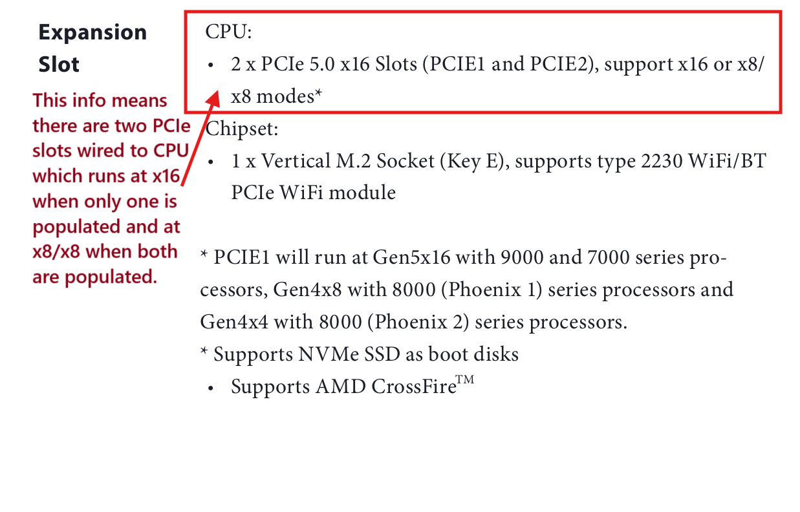
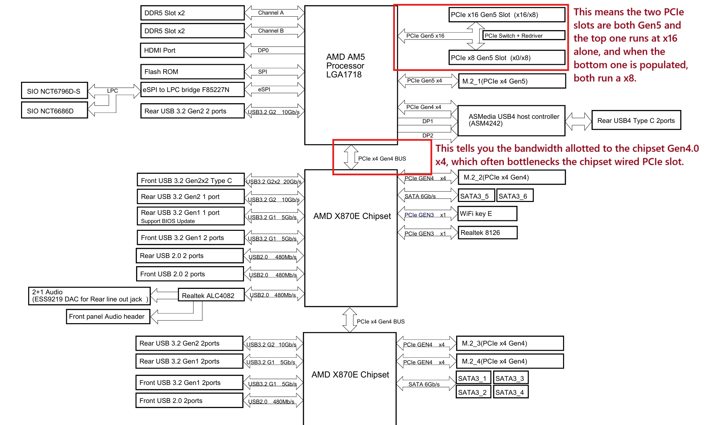
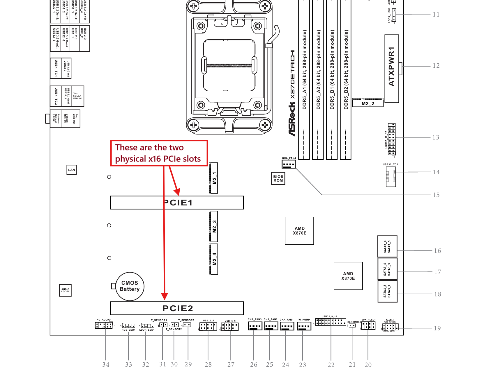
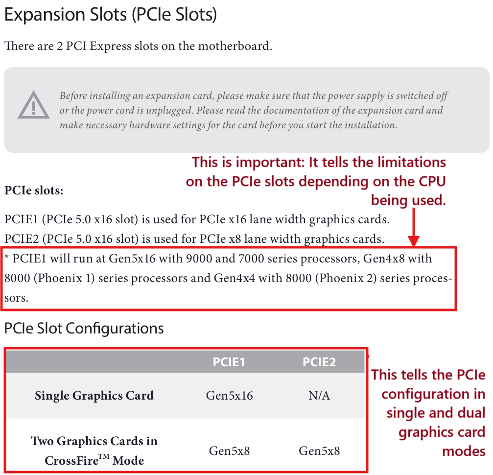

## How to understand the PCIe configuration from Motherboard Manual :

- The best and most accurate way of knowing about a motherboard's PCIe configuration is to check its official manual. Following are some tips on how to understand the information mentioned in the manuals.

  - Typically. manuals mention the specs just after the index. The 'Expansion Slots' section tells us about the PCIe slots on the motherboard.

  

  - The next most important page is the Block Diagram (if available in the manual).

  

  - The physical slots should also be confirmed via the image of the motherboard layout.

  

  - To confirm everything, scroll down to the 'Expansion Slot' section.

  

## Recommended PCIe for different resolutions and respective fps :

- Bandwidth Reference (Single Direction, in GB/s):

        | Config | Bandwidth | Config | Bandwidth |
        | --- | --- | --- | --- |
        | PCIe 2.0 x4 | 2.00 | PCIe 2.0 x8 | 4.00 |
        | PCIe 3.0 x4 | 3.94 | PCIe 3.0 x8 | 7.88 |
        | PCIe 4.0 x4 | 7.88 | PCIe 4.0 x8 | 15.75 |
        | PCIe 5.0 x4 | 15.75 | PCIe 5.0 x8 | 31.50 |

- Recommended PCIe slot speeds :
  - 1080p :         

        | Config       | 1080p (fps) | Config       | 1080p (fps) |
        |--------------|-------------|--------------|-------------|
        | PCIe 2.0 x4  | 120         | PCIe 4.0 x4  | a lot       |
        | PCIe 2.0 x8  | 240         | PCIe 4.0 x8  | a lot       |
        | PCIe 3.0 x4  | 240         | PCIe 5.0 x4  | a lot       |
        | PCIe 3.0 x8  | 540         | PCIe 5.0 x8  | a lot       |

  - 1440p :        

        | Config       | 1440p (fps) | Config       | 1440p (fps) |
        |--------------|-------------|--------------|-------------|
        | PCIe 2.0 x4  | 90          | PCIe 4.0 x4  | 240         |
        | PCIe 2.0 x8  | 180         | PCIe 4.0 x8  | 480         |
        | PCIe 3.0 x4  | 180         | PCIe 5.0 x4  | 480         |
        | PCIe 3.0 x8  | 240         | PCIe 5.0 x8  | 900+        |

  - 2160p :

        | Config       | 4K (fps)          | Config       | 4K (fps) |
        |--------------|-------------------|--------------|----------|
        | PCIe 2.0 x4  | 30 (not recommended) | PCIe 4.0 x4  | 165 |
        | PCIe 2.0 x8  | 60 (not recommended) | PCIe 4.0 x8  | 240 |
        | PCIe 3.0 x4  | 60 (not recommended) | PCIe 5.0 x4  | 240 |
        | PCIe 3.0 x8  | 165               | PCIe 5.0 x8  | 520+ |

## Quick answers to commonly asked questions.

### Q: My motherboard's website or manual says it has two x16 slots. Do both support x16 lanes?
**A**: No, in this instance the web/manual is referring to the slot name x16. Not the lane count of the slots. No consumer motherboard has 32 PCIe lanes, so both slots cannot have x16 lanes.

---

### Q: Can I use an M.2-to-PCIe adapter for my second GPU?  
**A:** Technically yes, **but** the slot will be limited to **x4 lanes maximum**, with some configurations providing only **x1 lane**. You **cannot** achieve x8 or x16 lanes this way, as consumer motherboard M.2 slots **only support up to x4 electrical lanes**.

1.  **Lane Configuration:**  
    -   M.2 slots connected **directly to the CPU** typically provide **x4 lanes**.  
    -   M.2 slots connected **via the chipset** may be limited to **x1 lane** (depending on motherboard design).  
2.  **Adapter Requirements:**  
    -   Use an adapter explicitly labeled **"M.2 PCIe x4 to PCIe x16 (x4 electrical)"**.  
    -   Avoid adapters without this specification – they may not utilize all available lanes.  
3.  **Critical Limitations:**  
    -   **Slot size ≠ Lane count:** The x16 slot on the adapter is *physical size only*; electrical lanes remain **x4 maximum**.  
    -   **PCIe Generation:** Match the adapter's generation (e.g., Gen 4.0) to your M.2 slot. A slower adapter (e.g., Gen 3.0) will bottleneck a Gen 4.0 slot.  
    -   **Performance Impact:** Even x4 lanes (especially Gen 3 x4) may bottleneck modern GPUs.  

---

### Q. Can I use a PCIe x1 to PCIe x16 adapter for my second GPU?
**A:** Technically yes, but it is not recommended. Performance will be severely bottlenecked. A PCIe x1 slot only has one electrical lane, meaning the x16 slot on the other end of the adapter will also only receive one lane. Every GPU requires more than one lane to function effectively.

---

### Q. Can I use a PCIe riser cable for my primary or secondary GPU?
**A:** Yes. Ensure the riser cable's PCIe generation matches or exceeds that of your GPU. Also, confirm the riser is rated for x16 lanes to ensure full bandwidth.

---

### Q. What is the ideal PCIe configuration for maximum dual-GPU performance?
**A:** Look for a motherboard with two PCIe x16 slots that support **x8/x8 mode**. This means both slots will operate with x8 lanes simultaneously. Additionally, make sure the slots' PCIe generation matches or exceeds that of your primary GPU. For example, if your GPU is PCIe 4.0, your motherboard slots should also be PCIe 4.0 or newer.

---

### Q. My motherboard has an option for "x8/x8" or "x4/x4/x4/x4" in the BIOS. Does this mean my motherboard supports dual GPUs at x8/x8?
**A:** No. This setting is for **PCIe bifurcation**. It's designed for splitter cards, which allow a single PCIe slot to connect to two or more devices. This setting allows the motherboard to split the lanes of a single physical slot and present them as multiple virtual slots to the operating system. Without it, the OS would be confused by two different hardware IDs originating from a single slot. Bifurcation is unrelated to using two separate physical slots on your motherboard for dual GPUs (unless you are connecting both GPUs to one slot via a splitter).

---

### Q. Are PCIe 3.0 x4 or PCIe 4.0 x4 good enough for me? Do I NEED x8/x8?
**A:** This depends on your specific hardware and usage: your primary GPU, secondary GPU, monitor resolution, and refresh rate. Ravenger created a helpful table estimating the PCIe bandwidth required for certain framerates and resolutions.

Excerpt from his guide:
*   **Below PCIe 3.0 x4:** May not work properly. Not recommended for any use case.
*   **PCIe 3.0 x4:** Supports up to 1080p @ 240fps, 1440p @ 180fps, or 4K @ 60fps (4K not recommended).
*   **PCIe 4.0 x4:** Supports up to 1080p @ 540fps, 1440p @ 240fps, or 4K @ 165fps.
*   **PCIe 4.0 x8:** Supports up to 1440p @ 480fps or 4K @ 240fps.

---

## Long-Form PCIe Tutorial

A detailed explanation of the PCIe standard for those interested in the underlying technology.

### PCIe Lanes
To simplify a complex topic, a PCIe lane is essentially a data link that connects your PCIe slot to your CPU or chipset. Think of them as lanes on a highway—they connect where you are to where you're going. Just like a road, only a certain number of lanes can fit on a given path.

A typical modern consumer CPU, such as a Ryzen 7000 or Intel 14th Gen series, has between 24 and 28 PCIe lanes directly available. The motherboard chipset also provides PCIe lanes, but these are generally slower and have higher latency as they connect indirectly to the CPU, like taking a backroad with a lower speed limit.

### PCIe Slot Names
You will most commonly see the term "x16" used to describe a GPU or a motherboard slot. This is the largest physical PCIe slot, named x16 because it has the physical contacts for 16 PCIe lanes. Similarly, there are smaller x8, x4, and x1 slots, named for the maximum number of lanes they can physically connect.

Most modern expansion cards (GPUs, sound cards, network cards, etc.) use either an x16 or x1 physical connector, so these are the most common slots on consumer motherboards. Think of an x16 slot as a 16-lane superhighway, an x8 slot as an 8-lane highway, an x4 slot as a 4-lane public street, and an x1 slot as a single-lane residential road.

### Why Slot Names Don't Equal Lane Counts
A key point is that a slot's physical size does not always match the number of electrical lanes it provides. The size (e.g., x16) only indicates the *maximum* number of lanes the slot *can* have. Motherboard manufacturers can wire a physical x16 slot with x16, x8, x4, or even just x1 electrical lane.

You must check your motherboard's manual to see how the PCIe slots operate. Because slot names are similar to lane counts, manufacturers will list the number of "x16 slots" a board has. This information only tells you the physical size. Typically, the primary PCIe x16 slot is wired for a full x16 lanes, though this can be reduced to x8 lanes in certain configurations (like a dual-GPU mode). The second and third PCIe x16 slots on a board may only be wired for x8, x4, or x1 lanes.

A motherboard manual might state: "2 x PCI Express x16 slots." This can be confusing. A more detailed spec sheet might clarify with something like: "1 x PCIe 5.0 x16 Slot (supports x16 mode)" and "1 x PCIe 3.0 x16 Slot (supports x4 mode)." This is much clearer. An ideal specification for a dual-GPU setup would read: "2 x PCIe 5.0 x16 Slots (support x16 or x8/x8 modes)."

### Adapters, Slots, and Lane Counts
The number of lanes is determined by the source, regardless of the adapter or destination slot size. If you use an adapter to turn a PCIe x1 slot into a physical x16 slot, you can plug in larger cards, but the connection will still only provide one lane of data. The same is true for an M.2 adapter—if the M.2 slot provides x4 lanes, the x16 slot on the other end of the adapter will only receive x4 lanes.

### PCIe Generation (Bandwidth)
PCIe Generation (e.g., 3.0, 4.0, 5.0) refers to the version of the standard a slot uses, which determines its bandwidth per lane. Think of it as the speed limit on your highway lane. It's sufficient to know that each new generation roughly doubles the bandwidth of the previous one.

This means PCIe 2.0 x16 has the same total bandwidth as PCIe 3.0 x8, which is the same as PCIe 4.0 x4. However, while the total bandwidth may be equivalent, **you cannot convert a lower number of lanes into a higher number**. For example, changing a PCIe 4.0 x4 slot to Gen 3.0 in the BIOS will not give you x8 lanes; it will simply become a slower PCIe 3.0 x4 slot.

### Why the Number of Lanes Still Matters
So, why do lanes matter if bandwidth can be equivalent? Graphics cards are designed for a specific number of lanes. A GPU built for PCIe 3.0 x16 has the same theoretical bandwidth as one built for PCIe 4.0 x8, but the way it communicates can differ.

A card with more available lanes has more pathways for data. Imagine a high-priority task needing to be sent. Instead of waiting for a congested lane to clear, the GPU could potentially use an entirely different lane, improving latency. Because of this, a GPU designed for 16 lanes may perform better in a native x16 slot than in an x8 slot with equivalent bandwidth, as it has more paths to negotiate for sending data.

### Total System Lanes
Consumer CPUs have a limited number of PCIe lanes (e.g., 20-28). On a typical system, 16 of these lanes are reserved for the primary GPU slot. If a second GPU is used, those 16 lanes are often split, providing x8 lanes to each of two slots. The remaining CPU lanes (e.g., 4-8 lanes) are usually dedicated to high-speed M.2 storage.

This is why consumer motherboards do not support two GPUs running at x16/x16—that would require 32 lanes, which consumer CPUs don't have. Only server or HEDT (High-End Desktop) platforms offer that many lanes. (Note: Having a top-of-the-line consumer CPU and GPU does not make your system HEDT; it's a separate class of enthusiast/workstation hardware not covered here.)

If the guide convinces you to get a motherboard that supports full-speed dual GPUs, here is a master list to help you choose:

> **[Tommy’s MOBO List](https://docs.google.com/document/d/e/2PACX-1vQx7SM9-SU_YdCxXNgVGcNFLLHL5mrWzliRvq4Gi4wytsbh2HCsc9AaCEFrx8Lao5-ttHoDYKM8A7UE/pub)**

