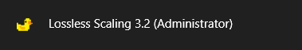
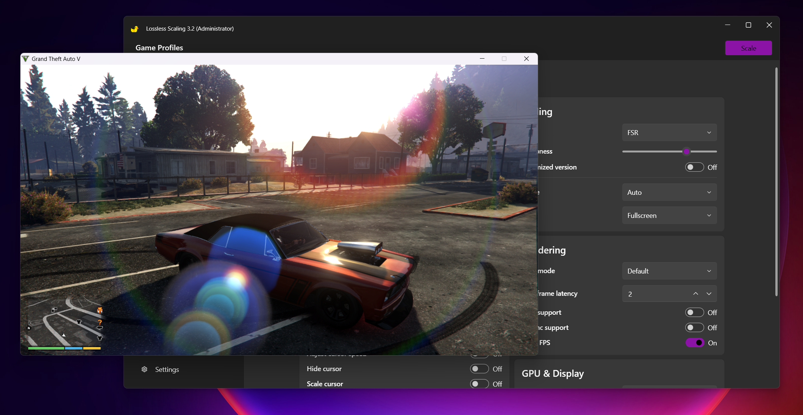

1.Run LS (as admin) - via the in-app setting and restart, or Right click on shortcut/exe > Run as Admin

2.Run the target app/game (windowed, windowed borderless or borderless fullscreen)

3.Click on Scale Button and activate/select the game window within 5 seconds / OR / Select the game and press the Scale Hotkey

4.The fps counter at top left shows the "base fps"/"final FG fps" and that the LS has sucessfully scaled. (Draw fps option should be enabled for this)

5.For videos in local players such as kmplayer/vlc/mpv the process is same. (If you want to upscale, resize the video player to original size and then use LS scalers)

6.For video streaming on the browsers, there are three ways :

  a.Download the "pip extension" in the browser (better for hard subbed videos) and play them in resized separate windows and scale with LS

  b.Fullscreen the video and scale with LS.

  c.Use the Crop pixels option in LS. You would need to measure the pixels distance from the edges of the screen and input them in the LS app. (You can use PowerToys - Screen Ruler for the pixel measurements)
  